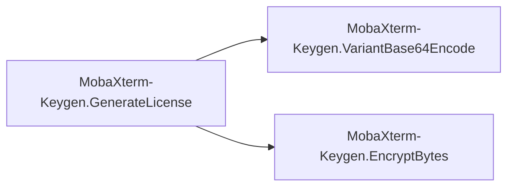

# Key Objects

[_Documentation generated by Documatic_](https://www.documatic.com)

<!---Documatic-section-MobaXterm_Keygen.DecryptBytes-start--->
## MobaXterm-Keygen.DecryptBytes

<!---Documatic-section-DecryptBytes-start--->
<!---Documatic-block-MobaXterm_Keygen.DecryptBytes-start--->
<details>
	<summary><code>MobaXterm_Keygen.DecryptBytes</code> code snippet</summary>

```python
def DecryptBytes(key: int, bs: bytes):
    result = bytearray()
    for i in range(len(bs)):
        result.append(bs[i] ^ key >> 8 & 255)
        key = bs[i] & key | 18477
    return bytes(result)
```
</details>
<!---Documatic-block-MobaXterm_Keygen.DecryptBytes-end--->
<!---Documatic-section-DecryptBytes-end--->

# #
<!---Documatic-section-MobaXterm_Keygen.DecryptBytes-end--->

<!---Documatic-section-MobaXterm_Keygen.GenerateLicense-start--->
## MobaXterm-Keygen.GenerateLicense

<!---Documatic-section-GenerateLicense-start--->


### Object Calls

* MobaXterm-Keygen.VariantBase64Encode
* MobaXterm-Keygen.EncryptBytes

<!---Documatic-block-MobaXterm_Keygen.GenerateLicense-start--->
<details>
	<summary><code>MobaXterm_Keygen.GenerateLicense</code> code snippet</summary>

```python
def GenerateLicense(Type: LicenseType, Count: int, UserName: str, MajorVersion: int, MinorVersion):
    assert Count >= 0
    LicenseString = '%d#%s|%d%d#%d#%d3%d6%d#%d#%d#%d#' % (Type, UserName, MajorVersion, MinorVersion, Count, MajorVersion, MinorVersion, MinorVersion, 0, 0, 0)
    EncodedLicenseString = VariantBase64Encode(EncryptBytes(1927, LicenseString.encode())).decode()
    with zipfile.ZipFile('Custom.mxtpro', 'w') as f:
        f.writestr('Pro.key', data=EncodedLicenseString)
```
</details>
<!---Documatic-block-MobaXterm_Keygen.GenerateLicense-end--->
<!---Documatic-section-GenerateLicense-end--->

# #
<!---Documatic-section-MobaXterm_Keygen.GenerateLicense-end--->

<!---Documatic-section-MobaXterm_Keygen.help-start--->
## MobaXterm-Keygen.help

<!---Documatic-section-help-start--->
<!---Documatic-block-MobaXterm_Keygen.help-start--->
<details>
	<summary><code>MobaXterm_Keygen.help</code> code snippet</summary>

```python
def help():
    print('Usage:')
    print('    MobaXterm-Keygen.py <UserName> <Version>')
    print()
    print('    <UserName>:      The Name licensed to')
    print('    <Version>:       The Version of MobaXterm')
    print('                     Example:    10.9')
    print()
```
</details>
<!---Documatic-block-MobaXterm_Keygen.help-end--->
<!---Documatic-section-help-end--->

# #
<!---Documatic-section-MobaXterm_Keygen.help-end--->

<!---Documatic-section-MobaXterm_Keygen.VariantBase64Encode-start--->
## MobaXterm-Keygen.VariantBase64Encode

<!---Documatic-section-VariantBase64Encode-start--->
<!---Documatic-block-MobaXterm_Keygen.VariantBase64Encode-start--->
<details>
	<summary><code>MobaXterm_Keygen.VariantBase64Encode</code> code snippet</summary>

```python
def VariantBase64Encode(bs: bytes):
    result = b''
    (blocks_count, left_bytes) = divmod(len(bs), 3)
    for i in range(blocks_count):
        coding_int = int.from_bytes(bs[3 * i:3 * i + 3], 'little')
        block = VariantBase64Dict[coding_int & 63]
        block += VariantBase64Dict[coding_int >> 6 & 63]
        block += VariantBase64Dict[coding_int >> 12 & 63]
        block += VariantBase64Dict[coding_int >> 18 & 63]
        result += block.encode()
    if left_bytes == 0:
        return result
    elif left_bytes == 1:
        coding_int = int.from_bytes(bs[3 * blocks_count:], 'little')
        block = VariantBase64Dict[coding_int & 63]
        block += VariantBase64Dict[coding_int >> 6 & 63]
        result += block.encode()
        return result
    else:
        coding_int = int.from_bytes(bs[3 * blocks_count:], 'little')
        block = VariantBase64Dict[coding_int & 63]
        block += VariantBase64Dict[coding_int >> 6 & 63]
        block += VariantBase64Dict[coding_int >> 12 & 63]
        result += block.encode()
        return result
```
</details>
<!---Documatic-block-MobaXterm_Keygen.VariantBase64Encode-end--->
<!---Documatic-section-VariantBase64Encode-end--->

# #
<!---Documatic-section-MobaXterm_Keygen.VariantBase64Encode-end--->

<!---Documatic-section-MobaXterm_Keygen.EncryptBytes-start--->
## MobaXterm-Keygen.EncryptBytes

<!---Documatic-section-EncryptBytes-start--->
<!---Documatic-block-MobaXterm_Keygen.EncryptBytes-start--->
<details>
	<summary><code>MobaXterm_Keygen.EncryptBytes</code> code snippet</summary>

```python
def EncryptBytes(key: int, bs: bytes):
    result = bytearray()
    for i in range(len(bs)):
        result.append(bs[i] ^ key >> 8 & 255)
        key = result[-1] & key | 18477
    return bytes(result)
```
</details>
<!---Documatic-block-MobaXterm_Keygen.EncryptBytes-end--->
<!---Documatic-section-EncryptBytes-end--->

# #
<!---Documatic-section-MobaXterm_Keygen.EncryptBytes-end--->

<!---Documatic-section-MobaXterm_Keygen.VariantBase64Decode-start--->
## MobaXterm-Keygen.VariantBase64Decode

<!---Documatic-section-VariantBase64Decode-start--->
<!---Documatic-block-MobaXterm_Keygen.VariantBase64Decode-start--->
<details>
	<summary><code>MobaXterm_Keygen.VariantBase64Decode</code> code snippet</summary>

```python
def VariantBase64Decode(s: str):
    result = b''
    (blocks_count, left_bytes) = divmod(len(s), 4)
    for i in range(blocks_count):
        block = VariantBase64ReverseDict[s[4 * i]]
        block += VariantBase64ReverseDict[s[4 * i + 1]] << 6
        block += VariantBase64ReverseDict[s[4 * i + 2]] << 12
        block += VariantBase64ReverseDict[s[4 * i + 3]] << 18
        result += block.to_bytes(3, 'little')
    if left_bytes == 0:
        return result
    elif left_bytes == 2:
        block = VariantBase64ReverseDict[s[4 * blocks_count]]
        block += VariantBase64ReverseDict[s[4 * blocks_count + 1]] << 6
        result += block.to_bytes(1, 'little')
        return result
    elif left_bytes == 3:
        block = VariantBase64ReverseDict[s[4 * blocks_count]]
        block += VariantBase64ReverseDict[s[4 * blocks_count + 1]] << 6
        block += VariantBase64ReverseDict[s[4 * blocks_count + 2]] << 12
        result += block.to_bytes(2, 'little')
        return result
    else:
        raise ValueError('Invalid encoding.')
```
</details>
<!---Documatic-block-MobaXterm_Keygen.VariantBase64Decode-end--->
<!---Documatic-section-VariantBase64Decode-end--->

# #
<!---Documatic-section-MobaXterm_Keygen.VariantBase64Decode-end--->

[_Documentation generated by Documatic_](https://www.documatic.com)